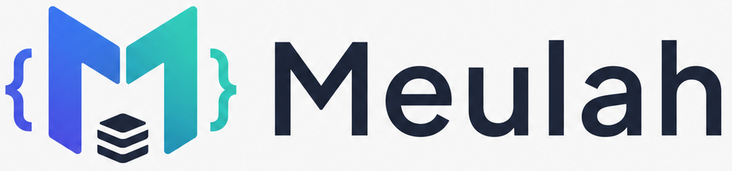

<p align="center">
  
</p>

<p align="center">
  <strong>A lightweight, explicit PHP framework for developers who want modern foundations without unnecessary complexity.</strong>
</p>

<p align="center">
  <a href="https://github.com/Meulah/framework">Framework</a>
  ·
  <a href="https://github.com/Meulah/meulah">Application Starter</a>
  ·
  <a href="https://github.com/orgs/Meulah/discussions">Discussions</a>
</p>

## About Meulah

Meulah is a lightweight PHP framework focused on clarity, small components, predictable behaviour, and application code that remains easy to understand.

The project separates the reusable framework kernel from the application starter:

- **[Meulah/framework](https://github.com/Meulah/framework)** — reusable framework core, HTTP components, routing, dependency injection, database tooling, migrations, console internals, and tests.
- **[Meulah/meulah](https://github.com/Meulah/meulah)** — the official application skeleton containing application bootstrap, configuration, routes, views, migrations, the public entry point, and the `php meulah` launcher.

## Getting Started

Create a new Meulah application:

```bash
composer create-project meulah/meulah my-app
cd my-app
```

Run the available console commands:

```bash
php meulah
```

Run database migrations:

```bash
php meulah migrate
```

## Design Principles

- **Explicit over magical** — framework behaviour should be understandable and traceable.
- **Lightweight by default** — applications should only carry the capabilities they need.
- **Secure foundations** — request handling, uploads, errors, database access, and destructive commands should fail safely.
- **Framework and application separation** — reusable infrastructure belongs in `framework`; application policy belongs in the starter.
- **Tested behaviour** — important framework guarantees should be covered by automated tests.

## Project Status

Meulah is under active development. APIs may change before the first stable release. Use it for learning, experimentation, and early projects while the framework matures.

## Contributing

Contributions, bug reports, architectural discussions, and documentation improvements are welcome.

Before submitting major changes, open a discussion or issue so the proposal can be evaluated against Meulah's lightweight and explicit design goals.

## Security

Please do not disclose security vulnerabilities publicly. Use GitHub's private vulnerability reporting feature in the affected repository when it is enabled.

## License

Meulah is open-source software released under the MIT License.
